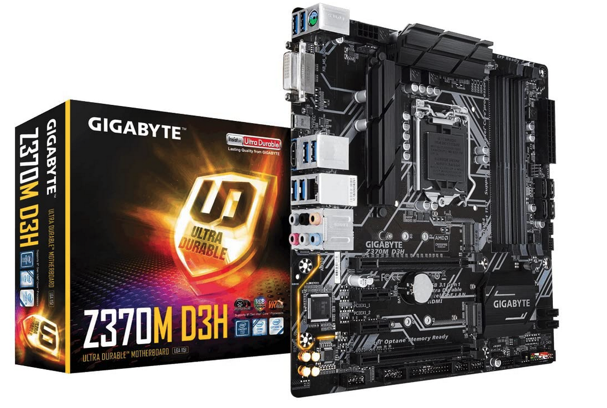

# Gigabyte Z370m D3H

### Computer Spec:

| Component        | Brank                              |
| ---------------- | ---------------------------------- |
| CPU              | Intel® i7 8700          |
| iGPU             | Intel® UHD Graphics 630            |
| dGPU             | AMD Radeon RX 580 Special Edition  
| Audio            | Realtek ALC892                     |
| Ram              | 16 Gb ddr4 2400 Mhz     |            |
| Lan              | Intel I219V2     |                   |
| Wifi             | ASUS AC56 BCM4352            
| NVMe             | Samsung 960 EVO 500 GB         
| SSD              | Samsung 860 EVO 500 GB              
| SmBios           | iMac 19.1                  
| BootLoader       | OpenCore 0.6.7                     

### What works and What doesn't or WIP:

- [x] Intel UHD 630 iGPU + HDMI AUDIO
- [x] ALC295 Frontal and Retro Panel
- [x] All USB Ports (No Type C)
- [x] SpeedStep / Sleep / Wake
- [x] Wi-Fi ASUS AC56 BCM4352 
- [x] Intel I219V2 LAN
- [x] NVRAM
- [x] Windows boot from OpenCore
- [x] dGPU Amd Rx 580 Special EDITION 

### Special Config:

- Usb port mapping performed
- SSDT-Hack Essential patch
- Applied cosmetics PCI Dev

## Credits

- [Apple](https://apple.com) for macOS;
- [Acidanthera](https://github.com/acidanthera) for OpenCore and all the lovely hackintosh work.
- [Dortania](https://github.com/dortania) For their detailed guides.
- [Vins95](https://github.com/Vins95)
- [Baio1977](https://github.com/Baio1977)
- [Hackintoshlifeit](https://github.com/Hackintoshlifeit)

# If you need help please contact us on [Telegram](https://t.me/HackintoshLife_it) 
